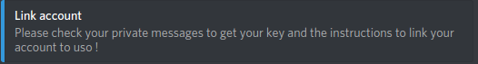
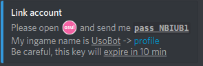

Uso Documentation
================

Some links :
- [github](https://github.com/Renondedju/Uso_Bot_V2.0)  
- [todo list](TODO.md)  

This documentation is divided under 3 main parts :

 - [Discord](#discord)  
 - [IRC (ingame bot)](#irc)  
 - [Api](#api)  

-----

## Discord ##

> **Note:**  
>  Here is a little code to be able to understand better commands :  
>  -> *o!command* **``required argument (n°1)``** ``optional argument (n°2)`` ``ect ...``  
> If multiple **``required arguments``** have the same n°, you __have to__ choose between one of them !  

-----

#### o!map ####  
 - Usage : *o!map* **``beatmap url (n°1)``** **``beatmap id (n°1)``** **``beatmapset url (n°1)``**  

This command allows you to visualize quickly stats on a beatmap or a beatmapset :  

[Some images here]  

-----

#### o!r ####  

 - Usage : *o!r* ``arg 1``  

----

#### o!link ###
 > This command allows you to link your discord account to a osu account  
 > in order to allow the discord bot to recommend you some beatmaps

  - Usage : o!link ***your_username***  
  
*Mhhh, your command does not seems to work ?*  
  
Ok, first ask to uso to link your account (o!link *your_username*)  
If you are on a server, uso should tell you something like this

  
  
Right after, you should get a DM like this one : 
*(Please make sure that the bot is allowed to DM you)*  

  

Now simply copy your pass (in our example ``pass NBIUB1``)  
And jump into osu !


-----  

## IRC ##  

> **Note:**  
> Introductive note here !  
  
#### o!r ####  

 - Usage : *o!r* ``arg 1``  

TODO  

-----

## API ##

> **Note:**  
> Introductive note here !  

Bla bla  

```Python
def HereIsSomeCode (and, args:int = 1):
	"""To explain a bit more what is the uso api ?"""
	pass
```